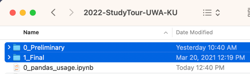

# 2022-StudyTour-UWA-KU

## How to proceed with the repository


### 1. Interpreter setup

```bash
conda create -n canids
conda activate canids
conda install python=3.10 pandas scikit-learn jupyter
```

(Updated on Nov. 17, 2022) Please install one additional package to plot some figures.
```
conda install matplotlib 
```

### 2. Clone this repository
```bash
git clone https://github.com/hksecurity/2022-StudyTour-UWA-KU
cd 2022-StudyTour-UWA-KU
```

### 3. Dataset preparation
CAR HACKING: ATTACK & DEFENSE CHALLENGE 2020 DATASET on IEEE DataPort (https://dx.doi.org/10.21227/qvr7-n418).  

Folders `0_Preliminary` and `1_Final` are supposed to be located at the root of this repository.



### 4. Run jupyter notebook
`jupyter notebook`
